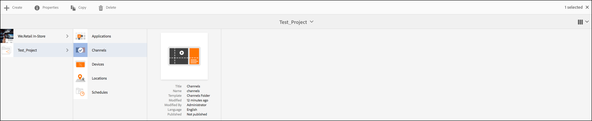

# Configuratie en probleemoplossing voor het afspelen van video{#video-playback-configuration-and-troubleshooting}

Wanneer u een video uploadt naar de DAM en deze aan uw kanaal toevoegt, kunnen er problemen optreden die video mogelijk niet afspeelt in de schermspeler.

In de volgende secties wordt beschreven hoe u fouten kunt opsporen in het afspelen van video in uw kanaal en hoe u deze kunt oplossen.

## DAM-uitvoeringen {#dam-renditions}

Nadat u de video naar het kanaal hebt geüpload, moet AEM beginnen met het maken van enkele uitvoeringen voor de video. U kunt uw video&#39;s weergeven onder Middelen.

De video weergeven:

1. Navigeer naar uw video, bijvoorbeeld `http://localhost:4502/assets.html/content/dam/we-retail/en/videos`.
1. Klik op de video, vouw het menu linksboven uit en klik op **Uitvoeringen**.

Er moeten verschillende uitvoeringen zijn (een MP4 of M4V).

Als er geen uitvoering is, controleert u of mpeg is geïnstalleerd op het besturingssysteem waarop AEM wordt uitgevoerd.

>[!CAUTION]
>
>Als er geen uitvoering is, controleert u of mpeg is geïnstalleerd op het besturingssysteem waarop AEM wordt uitgevoerd.
>
>Klik [hier](https://www.ffmpeg.org/download.html) om fmpeg te installeren.

## Video-elementen {#video-assets}

Als u geen bronkenmerk onder video ziet, kan het zijn dat de video niet is gecodeerd. Als de video op de juiste wijze is getranscodeerd, wordt deze weergegeven in het dashboard, zoals in de onderstaande afbeelding wordt getoond.

Controleer of mpeg is geïnstalleerd en of de videoprofielen zijn geïnstalleerd.

### Videoprofiel {#checking-video-profile} controleren

1. Navigeer naar **Video Profile**, dat wil zeggen `http://localhost:4502/etc/dam/video.html` en klik **Test Video** uploaden.

   

1. Upload een testvideo en klik **Ok** om met de transcodering te beginnen.

   Als de transcode ontbreekt, breid de output van ffmpeg uit om het even welke fouten in de consoleverrichting van ffmpeg te begrijpen.

   

   Ook als de videotranscodes het getranscodeerde bestand kunnen downloaden.

   

   >[!NOTE]
   >
   >Zorg ervoor dat u voldoende tijd geeft om de video te transcoderen (de tag moet nieuw zijn in plaats van te worden verwerkt) voordat u de video aan een kanaal toevoegt.

### Profiel controleren met videocomponent {#checking-profile-with-a-video-component}

Controleer de lijst met profielen in het paginaontwerp als de videocomponent niet correct is geconfigureerd.

1. Navigeer naar het kanaal en selecteer de modus **Design**.

   

1. Selecteer de video en open het **Edit** dialoogvenster. Open het tabblad **Profielen**.

   >[!NOTE]
   >Selecteer verschillende profielen (er moet ten minste het profiel &quot;Hoge kwaliteit H.264&quot; zijn).

### Video controleren in de Speler {#checking-the-video-in-the-web-player} van het Web

Gebruik **Web Player** `http://localhost:4502/content/mobileapps/cq-screens-player/firmware.html/content/screens/we-retail/locations/demo/flagship/single/device0` om het afspelen in browsers (Chrome en Safari) te valideren. Chrome wordt gebruikt op Android-apparaten terwijl Safari de OSX- en iOS-browser is.

Als de video niet wordt uitgevoerd op Safari, wordt deze niet uitgevoerd in de OSX- en iOS-spelers. Dit is waarschijnlijk een coderingsprobleem en de video moet opnieuw worden gecodeerd.

Ga als volgt te werk om een DAM-workflow te gebruiken om FullHD-uitvoeringen te maken:

1. Navigeer naar *workflowmodel admin*, dat wil zeggen `http://localhost:4502/libs/cq/workflow/admin/console/content/models.html/etc/workflow/models`.
1. Selecteer het model **Schermupdate-element**.
1. Klik **Start Workflow** van de actiebalk om het dialoogvenster **Run Workflow** te openen.

1. Selecteer uw video-element in **Payload**.
1. Klik **Run**.

>[!NOTE]
>
>Zorg ervoor dat u enige tijd hebt om de uitvoeringen te maken, maar laad de webspeler na een paar seconden/minuten (afhankelijk van de videogrootte) opnieuw in Safari.

#### Problemen met AutoPlay-beleidsmarkering {#troubleshooting-autoplay-policy-flag} oplossen

Als de AEM Screens-speler de video oppikt maar niet wordt weergegeven, moet u de markering Beleid automatisch afspelen oplossen.

Voer de onderstaande stappen uit om het probleem met de automatisch afspeelbeleidsmarkering van google op te lossen:

1. Navigeer naar ***chrome://flags/#autoplay-policy***
1. Wijzig **Beleid voor automatisch afspelen** van **Standaard** in **Geen gebruikersbeweging is vereist**

1. Start de webbrowser opnieuw en werk de speler bij

>[!NOTE]
>
>Meer over de beste praktijken voor goede gebruikerservaring met het nieuwe autoplay beleid in Chrome leren, te zien gelieve documentatie voor *de Veranderingen van het Beleid van Autoplay*, namelijk `https://developers.google.com/web/updates/2017/09/autoplay-policy-changes#webaudio`.

### Video synchroniseren over meerdere spelers {#syncing-video-across-multiple-players}

Als u video&#39;s synchroon wilt afspelen op meerdere apparaten, moet u de absolute strategie gebruiken voor de reeks waarvan de video deel uitmaakt.

#### Vereisten {#requirements}

* identieke 2+ spelers
* ideaal vergelijkbare hardware
* identieke netwerktopologie (de spelers worden verbonden met een server NTP die hun interne systeemklokken richt)

#### De absolute strategie instellen {#setting-up-the-absolute-strategy}

De absolute strategie:

* berekent een ankertijd (middernacht van de huidige dag)
* berekent de duur van de reeks (som van de duur van alle items in de reeks)
* op om het even welk ogenblik, berekent het welk punt momenteel en het volgende punt door opeenvolging _remaining_time = (current_time - anchor_time) % sequence_duration zou moeten worden gespeeld.

Volg de onderstaande stappen om een absolute strategie op te zetten:

1. Navigeer naar de auteur van het kanaal en selecteer de sequentiecomponent zoals in de onderstaande afbeelding wordt getoond.
1. Open het configuratievenster.
1. Bewerk de **Strategie** en voeg absoluut toe.

   

   >[!NOTE]
   >Het besturingssysteem van de spelers moet dezelfde klok hebben.

**De uitlijningsklokken op OS** XFolle de stappen hieronder om de klokken op OSX uit te lijnen:

1. Open **Voorkeuren voor datum en tijd** op elk OSX-vak
1. **Datum en tijd automatisch instellen**
1. Waarde 0.pool.ntp.org, 1.pool.ntp.org, 2.pool.ntp.org, 3.pool.ntp.org, time.apple.com in de vervolgkeuzelijst of gewoon *sudo ntpdate -u -v 0.pool.ntp.org* uitvoeren
1. De 2+ spelers starten

Het kan enige tijd duren voordat de spelers een nieuwe uitgelijnde reeks beginnen.

