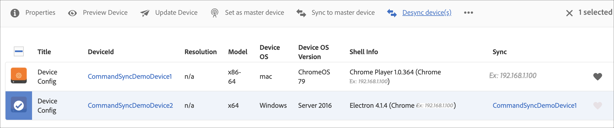

# Opdrachtsynchronisatie {#command-sync}

Op de volgende pagina wordt beschreven hoe u Command Sync kunt gebruiken. Met Command Sync kunt u het afspelen tussen verschillende spelers synchroniseren. De spelers kunnen verschillende inhoud afspelen, maar elk element moet dezelfde duur hebben.

>[!IMPORTANT]
>
>Deze functie biedt geen ondersteuning voor ingesloten reeksen, dynamische ingesloten reeksen, toepassingskanalen of overgangen.

## Overzicht {#overview}

Digitale signaaloplossingen moeten videomuren en gesynchroniseerd afspelen ondersteunen. Dit scenario is waar als u scenario&#39;s zoals de tellingen van het Nieuwjaar probeert te steunen of grote video die omhoog wordt gesegmenteerd om over veelvoudige schermen te spelen. Dergelijke scenario&#39;s zijn waar de Synchronisatie van het Bevel in spel komt.

Om de Synchronisatie van het Bevel te gebruiken, doet één speler dienst als a *primaire* en verzendt het bevel en alle andere spelers handelen als *cliënten* en spelen wanneer zij het bevel ontvangen.

*primaire* verzendt een bevel naar alle geregistreerde cliënten wanneer het op het punt staat om playback van een punt te beginnen. De nuttige lading van deze actie kan de index van het te spelen punt, of buitenste html van het te spelen element zijn, of allebei.

## Opdrachtsynchronisatie implementeren {#using-command-sync}

In de volgende sectie wordt beschreven hoe u Command Sync in een AEM Screens-project kunt gebruiken.

>[!NOTE]
>
>Voor gesynchroniseerd afspelen is het vereist dat alle hardwareapparaten dezelfde hardwarespecificaties hebben en bij voorkeur hetzelfde besturingssysteem. Synchroniseren tussen verschillende hardware en besturingssystemen wordt afgeraden.

### Het project instellen {#setting-up}

Alvorens u de eigenschap van de Synchronisatie van het Bevel gebruikt, zorg ervoor u een project en een kanaal met vastgestelde inhoud voor uw project hebt.

1. Het volgende voorbeeld toont een demoproject genoemd **CommandSyncDemo** en een opeenvolgingskanaal **ChannelLobby**.

   

   >[!NOTE]
   >
   >Leren hoe te om een kanaal tot stand te brengen of inhoud aan een kanaal toe te voegen, zie [ Creërend en het Leiden Kanalen ](/help/user-guide/managing-channels.md)

   Het kanaal bevat de volgende inhoud, zoals in de onderstaande afbeelding wordt getoond.

   

1. Creeer een plaats **Lobby** en dan een vertoning die als **wordt genoemd LobbyDisplay** in de **omslag van Plaatsen**, zoals aangetoond in het hieronder cijfer.
   

1. Wijs het kanaal, **ChannelLobby** aan uw **LobbyDisplay** toe. U kunt het toegewezen kanaal nu vanaf het weergavedashboard bekijken op de weergave.
   

   >[!NOTE]
   >
   >Leren hoe te om een kanaal aan een vertoning toe te wijzen, zie [ Creërend en het Leiden Vertoningen ](/help/user-guide/managing-displays.md).

1. Navigeer aan de **omslag van Apparaten**.
1. Klik **Manager van het Apparaat** van de actiebar.

   

   >[!NOTE]
   >
   >Leren hoe te om een apparaat te registreren, zie [ Registratie van het Apparaat ](/help/user-guide/device-registration.md)

1. In dit voorbeeld worden een Chrome-apparaat en een Windows Player voor demo-doeleinden als twee aparte apparaten weergegeven. Beide apparaten wijzen aan de zelfde vertoning.
   

### Kanaalinstellingen bijwerken

1. Navigeer aan **ChannelLobby**.
1. Klik **uitgeven** van de actiebar.
1. Klik op het volledige kanaal zoals in de onderstaande afbeelding wordt weergegeven.
   

1. Klik op het moersleutelpictogram.
   

1. In het **de dialoogvakje van de Pagina**, ga het *gesynchroniseerde* sleutelwoord op het **Strategie** gebied in.
   

### Een primaire {#setting-up-primary}

1. Navigeer aan het vertoningsdashboard van **CommandSyncDemo** > **Plaatsen** > **Lobby** > **LobbyDisplay**. Dan klik **Dashboard** van de actiebar.
Merk de twee apparaten (Chrome en de Speler van Vensters) in **APPARATEN** paneel, zoals in het volgende zien:
   

1. Van het **paneel van APPARATEN**, klik het apparaat u als primair wilt plaatsen. In het volgende voorbeeld ziet u hoe u het Chrome-apparaat instelt als het primaire apparaat. Klik **Reeks als primair apparaat**.

   

1. Ga het IP adres in **Reeks als primair apparaat** in en klik **sparen**.

   

>[!NOTE]
>
>U kunt meerdere apparaten instellen als primaire apparaten.

### Synchroniseren met primaire {#sync-up-primary}

1. Nadat u het Chrome-apparaat als primair apparaat hebt ingesteld, synchroniseert u het andere apparaat (in dit geval de Windows Player) met het primaire apparaat.
Klik het andere apparaat (in dit geval, de Speler van Vensters) van het **paneel van APPARATEN** en klik **Synchronisatie aan primair apparaat**.

   

1. Klik het apparaat van de lijst en klik **sparen**.

   >[ NOTA:]
   > De **Synchronisatie aan primaire apparaat** dialoogdoos toont de lijst van primaire apparaten. Selecteer de gewenste optie.

1. Wanneer het apparaat (de Speler van Vensters) aan primair (de Speler van Chrome) wordt gesynchroniseerd, kunt u het apparaat zien dat in het **wordt gesynchroniseerd APPARATEN** paneel.

   

### De-synchroniseren met de primaire {#desync-up-primary}

Nadat u een apparaat of apparaten naar een primair apparaat hebt gesynchroniseerd, kunt u de toewijzing van dat apparaat desynchroniseren.

>[!NOTE]
>
>Als u de synchronisatie van een primair apparaat ongedaan maakt, worden ook alle clientapparaten die aan dat primaire apparaat zijn gekoppeld, ontkoppeld.

Volg onderstaande stappen om de synchronisatie van het primaire apparaat te verwijderen:

1. Navigeer aan het **paneel van APPARATEN** en klik het apparaat.

1. Klik **Desync apparaten** zodat kunt u de cliënt van het primaire apparaat desynchroniseren.

   

1. Klik **bevestigen** om het geselecteerde apparaat van primair te dessynchroniseren.

   >[ NOTA:]
   > Als u op het primaire apparaat klikt en de optie Niet-synchroniseren gebruikt, worden alle apparaten die op het primaire apparaat zijn aangesloten in één stap gedesynchroniseerd.
