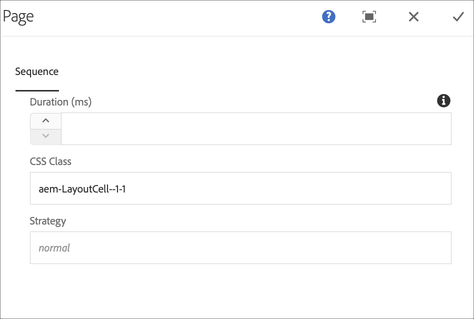

# Opdrachtsynchronisatie {#command-sync}

Op de volgende pagina wordt beschreven hoe u Command Sync kunt gebruiken. Met Command Sync kunt u het afspelen tussen verschillende spelers synchroniseren. De spelers kunnen verschillende inhoud afspelen, maar elk element moet dezelfde duur hebben.

>[!IMPORTANT]
>Deze functie ondersteunt geen ingesloten reeksen, dynamische ingesloten reeksen, toepassingskanalen of overgangen.

## Overzicht {#overview}

De digitale signaaloplossingen moeten videomuren en gesynchroniseerde playback steunen om scenario&#39;s zoals tellingen van Nieuwjaar of grote video te steunen die over veelvoudige schermen worden gesegmenteerd en dit is waar de Synchronisatie van het Bevel in spel komt.

Om de Synchronisatie van het Bevel te gebruiken, handelt één speler als *hoofd* en verzendt bevel en alle andere spelers handelen als *cliënten* en spelen wanneer zij het bevel ontvangen.

De *master* verzendt een opdracht naar alle geregistreerde clients wanneer het starten van het afspelen van een item op het punt staat. De nuttige lading van dit kan de index van het te spelen punt en/of buitenste html van het te spelen element zijn.

## Opdrachtsynchronisatie implementeren {#using-command-sync}

De volgende sectie beschrijft hoe u de Synchronisatie van het Bevel in een project van het Scherm kunt gebruiken AEM.

>[!NOTE]
>Voor gesynchroniseerd afspelen is het vereist dat alle hardwareapparaten dezelfde hardwarespecificaties hebben en bij voorkeur hetzelfde besturingssysteem. Synchroniseren tussen verschillende hardware en besturingssystemen wordt afgeraden.

### Het project instellen {#setting-up}

Voordat u de functie Opdrachtsynchronisatie gebruikt, moet u een project en een kanaal met inhoud instellen voor uw project.

1. In het volgende voorbeeld ziet u een demoproject met de naam **CommandSyncDemo** en een **ChannelLobby** met volgordekanalen.

   

   >[!NOTE]
   >
   >Raadpleeg Kanalen [maken en beheren voor meer informatie over het maken van een kanaal of het toevoegen van inhoud aan een kanaal](/help/user-guide/managing-channels.md)

   Het kanaal bevat de volgende inhoud, zoals in de onderstaande afbeelding wordt getoond.

   

1. Maak een weergave in de map **Locations** , zoals in de onderstaande afbeelding wordt getoond.
   

1. Wijs het kanaal, **ChannelLobby** , toe aan uw **LobbyDisplay**.
   

   >[!NOTE]
   >
   >Leer hoe te om een kanaal aan een vertoning toe te wijzen, verwijs naar het [Creëren van en het Leiden Vertoningen](/help/user-guide/managing-displays.md).

1. Navigeer naar de map **Apparaten** en klik op **Apparaatbeheer** op de actiebalk om de apparaten te registreren.

   

   >[!NOTE]
   >
   >Leer hoe te om een kanaal aan een vertoning toe te wijzen, verwijs naar het [Creëren en het Leiden Vertoningen](/help/user-guide/managing-displays.md)

1. In dit voorbeeld worden voor demo-doeleinden een chroom- en een Windows-speler weergegeven als twee aparte apparaten. Beide apparaten wijzen aan de zelfde vertoning.
   

### Kanaalinstellingen bijwerken

1. Navigeer naar **ChannelLobby** en klik op **Bewerken** op de actiebalk om de kanaalinstellingen bij te werken.

1. Selecteer het volledige kanaal zoals weergegeven in de onderstaande afbeelding.
   

1. Klik op het moersleutelpictogram om het dialoogvenster **Pagina** te openen.
   

1. Voer het *gesynchroniseerde* trefwoord in het veld **Strategie** in.

   

### Een stramien instellen {#setting-up-master}

1. Navigeer naar het weergavedashboard vanaf **CommandSyncDemo** —> **Locations** —> **Lobby** —> **LobbyDisplay** en klik op het **dashboard** op de actiebalk.
De twee apparaten (de chroom- en vensterspeler) worden weergegeven in het deelvenster **APPARATEN** , zoals in de onderstaande afbeelding wordt getoond.
   

1. Selecteer in het deelvenster **APPARATEN** het apparaat dat u als stramien wilt instellen. In het volgende voorbeeld ziet u hoe u het Chrome-apparaat instelt als het stramien. Klik op **Instellen als hoofdapparaat**.

   

1. Voer het IP-adres in **Set in als hoofdapparaat** en klik op **Opslaan**.

   

>[!NOTE]
> U kunt meerdere apparaten instellen als stramien.

### Synchroniseren met stramien {#sync-up-master}

1. Nadat u het Chrome-apparaat als stramien hebt ingesteld, kunt u het andere apparaat (in dit geval de Windows-speler) synchroniseren met het stramien.
Selecteer het andere apparaat (in dit geval de vensterspeler) in het deelvenster **APPARATEN** en klik op **Synchroniseren met hoofdapparaat**, zoals in de onderstaande afbeelding wordt getoond.

   

1. Selecteer het apparaat in de lijst en klik op **Opslaan**.

   >[OPMERKING:]
   > In het dialoogvenster **Synchroniseren met hoofdapparaat** wordt de lijst met hoofdapparaten weergegeven. U kunt de gewenste optie selecteren.

1. Nadat het apparaat (Windows-speler) is gesynchroniseerd met de master (Chrome-speler), wordt het apparaat gesynchroniseerd in het deelvenster **APPARATEN** .

   

### De-synchroniseren met de meester {#desync-up-master}

Nadat u een apparaat of apparaten naar een stramien hebt gesynchroniseerd, kunt u de synchronisatie van dat apparaat ongedaan maken.

>[!NOTE]
>Als u de synchronisatie van een hoofdapparaat ongedaan maakt, worden ook alle clientapparaten ontkoppeld die aan dat hoofdapparaat zijn gekoppeld.

Voer de onderstaande stappen uit om de synchronisatie van het hoofdapparaat te verwijderen:

1. Navigeer naar het deelvenster **APPARATEN** en selecteer het apparaat.

1. Klik op **Desync-apparaat(en)** om de synchronisatie van de client met het hoofdapparaat ongedaan te maken.

   

1. Klik op **Bevestigen** om de synchronisatie van het geselecteerde apparaat met het stramien ongedaan te maken.

   >[OPMERKING:]
   > Als u het hoofdapparaat selecteert en de optie Niet-synchroniseren gebruikt, worden alle apparaten die op het stramien zijn aangesloten, in één stap gedesynchroniseerd.
