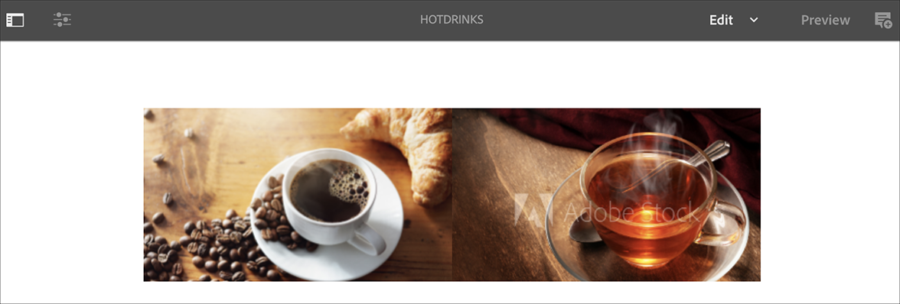
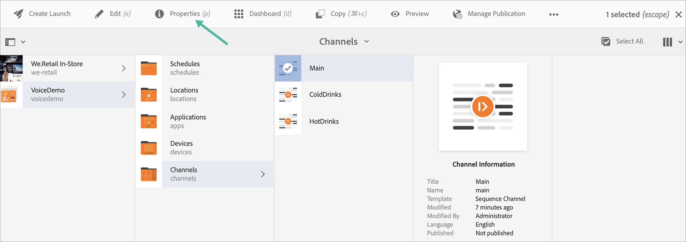

# Spraakherkenning in AEM Screens {#voice-recognition}

>[!IMPORTANT]
>
>**Belangrijke privacygegevens**
>
>Wanneer het gebruiken van de eigenschap van de stemerkenning volgt alle toepasselijke wettelijke en ethische richtlijnen voor uw regio (met inbegrip van maar niet beperkt tot het verstrekken van een zichtbare kennisgeving aan eindgebruikers dat de speler de Erkenning van de Stem gebruikt). Adobe Inc., ontvangt, slaat of verwerkt geen van de stemgerelateerde informatie op. De AEM Screens-spelers gebruiken de standaard webspraak-API die in de bladerengine is ingebouwd. Achter de schermen verzendt deze API een golfvorm van uw toespraak naar de servers van Google voor omzetting van spraak in tekst en deze tekst wordt aangepast door de speler aan gevormde sleutelwoorden.
>
>Raadpleeg het white paper over [Google Privacy op de webspraak-API](https://www.google.com/chrome/privacy/whitepaper.html#speech) voor meer informatie.

De eigenschap van de stemerkenning staat inhoudsverandering in een kanaal van AEM Screens toe dat door steminteractie wordt gedreven.

Een inhoudauteur kan een vertoning vormen om toegelaten stem te zijn. Het doel van deze eigenschap is klanten toe te staan om toespraak als methode te gebruiken om met hun vertoningen in wisselwerking te staan. Tot andere gebruiksgevallen behoren het vinden van productaanbevelingen in winkels, het bestellen van menu-items in restaurants en diners. Deze functie vergroot de toegankelijkheid voor gebruikers en kan de gebruikerservaring aanzienlijk verbeteren.

>[!NOTE]
>De spelerhardware moet audio-invoer, zoals een microfoon, ondersteunen.

## Spraakherkenning implementeren {#implementing}

>[!IMPORTANT]
> De functie voor spraakherkenning is alleen beschikbaar voor Chrome OS- en Windows-spelers.

Als u spraakherkenning wilt implementeren in uw AEM Screens-project, moet u de spraakherkenning inschakelen voor de weergave en elk kanaal koppelen aan een unieke tag om een kanaalovergang te activeren.

De volgende sectie beschrijft hoe u de eigenschap van de Erkenning van de Stem in een project van AEM Screens kunt toelaten en gebruiken.

## Inhoud weergeven in Volledig scherm of Kanaalschakelaar splitsen {#sequence-channel}

Alvorens u de eigenschap van de Erkenning van de Stem gebruikt, zorg ervoor u een project en een kanaal met inhoud hebt opstelling voor uw project.

1. Het volgende voorbeeld toont een demoproject genoemd **VoiceDemo** en drie opeenvolgingskanalen **Hoofd**, **ColdDrinks**, en **HotDrinks**, zoals aangetoond in het hieronder cijfer.

   

   >[!NOTE]
   >
   >Raadpleeg Kanalen [maken en beheren voor meer informatie over het maken van een kanaal of het toevoegen van inhoud aan een kanaal](/help/user-guide/managing-channels.md)

   Of

   U kunt drie opeenvolgingskanalen **Hoofd**, **ColdDrinks**, en **HeteKranken**, en één extra 1x2 Gesplitst het kanaal **SplitScreen** van het Scherm zoals aangetoond in het hieronder cijfer tot stand brengen.

   

1. Navigeer naar elk kanaal en voeg inhoud toe. Navigeer bijvoorbeeld naar **VoiceDemo** —> **Kanalen** —> **Hoofd** en selecteer het kanaal. Klik op **Bewerken** op de actiebalk om de editor te openen en naar wens inhoud (afbeeldingen/video&#39;s) toe te voegen. Voeg op dezelfde manier inhoud toe aan zowel **ColdDrinks** als het **HotDrinks** -kanaal.

   De kanalen bevatten nu elementen (afbeeldingen), zoals in de onderstaande afbeeldingen wordt getoond.

   **Hoofd**:

   

   **ColdDrinks**:

   

   **HotDrinks**:

   

   Als u het gesplitste kanaal van de Schermen aan uw project hebt toegevoegd, navigeer aan **SplitScreen** en sleep en laat vallen twee ingebedde opeenvolgingen en voeg wegen aan zowel **ColdDrinks** als **HotDrinks** kanaal zoals aangetoond in hieronder figuur toe.
   

### Labels instellen voor kanalen {#setting-tags}

Zodra u inhoud aan uw kanalen hebt toegevoegd, moet u aan elk van de kanalen navigeren en aangewezen markeringen toevoegen die de stemerkenning zouden teweegbrengen.

Voer de onderstaande stappen uit om codes aan uw kanaal toe te voegen:

1. Navigeer naar elk kanaal en voeg inhoud toe. Navigeer bijvoorbeeld naar **VoiceDemo** —> **Kanalen** —> **Hoofd** en selecteer het kanaal.

1. Klik op **Eigenschappen** op de actiebalk.

   

1. Navigeer naar het tabblad **Basisbeginselen** en selecteer een bestaand label in het veld **Codes** of maak een nieuw label.

   U kunt een nieuwe tag maken door een nieuwe naam voor de tag op te geven en op de `return` toets te drukken, zoals in de onderstaande afbeelding wordt getoond:

   

   Of

   U kunt van uw AEM instantie vooraf markeringen voor uw project tot stand brengen en die ook selecteren. Nadat u de stappen hebt uitgevoerd die zijn beschreven in [Codes](#creating-tags)maken, kunt u de code op de locatie selecteren en aan het kanaal toevoegen, zoals in de onderstaande afbeelding wordt getoond:

   

1. U kunt ook een tag met de naam **hot** toevoegen aan het kanaal **HotDrinks** .

1. Als u een gesplitst kanaal van het Scherm gebruikt, voeg zowel de markeringen (**heet** als **koud**) aan de het kanaaleigenschappen van **SplitScreen** toe.

   

1. Klik op **Opslaan en sluiten** als u klaar bent.

### Tags maken {#creating-tags}

Ga als volgt te werk om labels te maken:

1. Navigeer naar de AEM.

1. Klik op Gereedschappen —> **Tags toevoegen**.
   

1. Klik op **Maken** —> **Naamruimte**maken.
   

1. Ga de naam van uw project, bijvoorbeeld, **VoiceDemo** in en klik **creëren**.

1. Selecteer het **project VoiceDemo** en klik op Tag **** maken op de actiebalk.
   

1. Voer de naam van de tag in en klik op **Verzenden**.
   

U kunt deze labels nu gebruiken in uw AEM Screens-project.

### Het toewijzen van Kanaal aan een Vertoning en het toelaten van de Erkenning van de Stem {#channel-assignment}

1. Maak een weergave in de map **Locations** , zoals in de onderstaande afbeelding wordt getoond.

   

   >[!NOTE]
   >Leer hoe te om een kanaal aan een vertoning toe te wijzen, verwijs naar het [Creëren van en het Leiden Vertoningen](/help/user-guide/managing-displays.md).

1. Wijs de kanalen **Main**, **ColdDrinks**, en **HotDrinks** aan uw **LobbyDisplay** toe.

   >[!NOTE]
   >Als u een gesplitst-rasterkanaal hebt gemaakt, wijst u het kanaal **SplitScreen** toe aan de weergave.

1. Stel de volgende eigenschappen in voor elk kanaal terwijl u het kanaal toewijst.

   | **Kanaalnaam** | **Prioriteit** | **Ondersteunde gebeurtenissen** |
   |---|---|---|
   | Hoofd | 2 | Eerste belasting, inactief scherm, timer |
   | HotDrinks | 1 | Gebruikersinteractie |
   | ColdDrinks | 1 | Gebruikersinteractie |

   >[!NOTE]
   >
   >Leer hoe te om een kanaal aan een vertoning toe te wijzen, verwijs naar het [Creëren van en het Leiden Vertoningen](/help/user-guide/managing-displays.md).

1. Nadat u kanalen aan een weergave hebt toegewezen, navigeert u naar **LobbyDisplay** en selecteert u de weergave. Selecteer **Eigenschappen** op de actiebalk.

1. Navigeer naar het tabblad **Weergave** en schakel de optie **Voice ingeschakeld** in onder **Inhoud**.

   

   >[!IMPORTANT]
   >Het is verplicht om de functie voor spraakherkenning vanuit de weergave in te schakelen.

### De inhoud weergeven in de Chrome Player {#viewing-content}

Wanneer de voorgaande stappen zijn voltooid, kunt u het chroomapparaat registreren om de uitvoer weer te geven.

>[!NOTE]
>Raadpleeg [Apparaatregistratie](device-registration.md) voor informatie over het registreren van een apparaat bij een AEM Screens-speler.

In dit voorbeeld wordt de uitvoer op een Chrome-speler getoond.

Het **hoofdkanaal** speelt zijn inhoud af, maar wanneer u woorden met sleutelwoord **heet** zoals *ik een hete drank* zou willen gebruiken, begint het kanaal de inhoud van het **HotDrinks** kanaal te spelen.

Als u woorden gebruikt met een trefwoord dat **koud** is, zoals *ik iets koud* wil hebben, begint het kanaal met het afspelen van de inhoud van het **ColdDrinks** -kanaal.

In dit voorbeeld wordt de uitvoer op een Chrome-speler getoond.

Het **Hoofdkanaal** speelt zijn inhoud, maar wanneer u woorden met sleutelwoord **heet** en **koud** samen zoals *ik het menu voor hete en koude dranken* zou willen zien, begint het kanaal de inhoud van het **SplitScreen** kanaal te spelen. Als u *terug naar hoofdmenu* zegt, schakelt het terug naar het belangrijkste kanaal.

