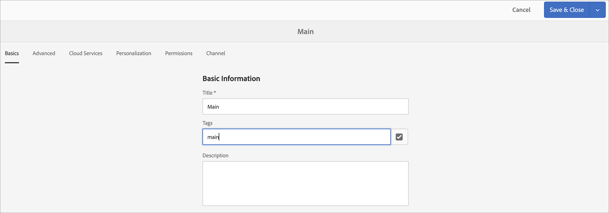

# Spraakherkenning in AEM Screens {#voice-recognition}

>[BELANGRIJK]
>**Belangrijke privacygegevens**
>Wanneer het gebruiken van de eigenschap van de Erkenning van de Stem volg alle toepasselijke wettelijke en ethische richtlijnen voor uw gebied (met inbegrip van maar niet beperkt tot het verstrekken van een zichtbare kennisgeving aan eind - gebruikers dat de speler de Erkenning van de Stem gebruikt). Adobe Inc., ontvangt, slaat of verwerkt geen van de stemgerelateerde informatie op. De AEM Screens-spelers gebruiken de standaard webspraak-API die in de bladerengine is ingebouwd. Achter de schermen wordt een golfvorm van uw toespraak naar de servers van Google verzonden voor conversie van spraak naar tekst en deze tekst wordt door de speler vergeleken met geconfigureerde trefwoorden.
>
>Raadpleeg het white paper over [Google Privacy op de webspraak-API](https://www.google.com/chrome/privacy/whitepaper.html#speech) voor meer informatie.

## Overzicht {#overview}

De eigenschap van de Erkenning van de Stem staat inhoudsverandering in een kanaal van AEM Screens toe dat door steminteractie wordt gedreven.

Een inhoudauteur kan een vertoning vormen om toegelaten stem te zijn. Het doel van deze eigenschap is klanten toe te staan om toespraak als methode te gebruiken om met hun vertoningen in wisselwerking te staan. Tot andere gebruiksgevallen behoren het vinden van productaanbevelingen in winkels, het bestellen van menu-items in restaurants en diners. Deze functie vergroot de toegankelijkheid voor gebruikers en kan de gebruikerservaring aanzienlijk verbeteren.

>[!NOTE]
>De spelerhardware moet audio-invoer, zoals een microfoon, ondersteunen.

>[!IMPORTANT]
> De functie voor spraakherkenning is alleen beschikbaar voor Chrome- en Electron-spelers.

## Spraakherkenning implementeren {#implementing}

Als u spraakherkenning wilt implementeren in uw AEM Screens-project, moet u de spraakherkenning inschakelen voor de weergave en elk kanaal koppelen aan een unieke tag om een kanaalovergang te activeren.

De volgende sectie beschrijft hoe u de eigenschap van de Erkenning van de Stem in een project van AEM Screens kunt toelaten en gebruiken.

### Het project instellen {#setting-up}

Alvorens u de eigenschap van de Erkenning van de Stem gebruikt, zorg ervoor u een project en een kanaal met inhoud hebt opstelling voor uw project.

1. Het volgende voorbeeld toont een demoproject genoemd **VoiceDemo** en drie opeenvolgingskanalen **Hoofd**, **ColdDrinks**, en **HotDrinks**, zoals aangetoond in het hieronder cijfer.

   

   >[!NOTE]
   >
   >Raadpleeg Kanalen [maken en beheren voor meer informatie over het maken van een kanaal of het toevoegen van inhoud aan een kanaal](/help/user-guide/managing-channels.md)

1. Navigeer naar elk kanaal en voeg inhoud toe. Navigeer bijvoorbeeld naar **VoiceDemo** —> **Kanalen** —> **Hoofd** en selecteer het kanaal. Klik op **Bewerken** op de actiebalk om de editor te openen en naar wens inhoud (afbeeldingen/video&#39;s) toe te voegen. Voeg op dezelfde manier inhoud toe aan zowel **ColdDrinks** als het **HotDrinks** -kanaal.

   De kanalen bevatten nu elementen (afbeeldingen), zoals in de onderstaande afbeeldingen wordt getoond.

   **Hoofd**:

   

   **ColdDrinks**:

   

   **HotDrinks**:

   

### Labels instellen voor kanalen {#setting-tags}

Zodra u inhoud aan uw kanalen hebt toegevoegd, moet u aan elk van de kanalen navigeren en aangewezen markeringen toevoegen die de stemerkenning zouden teweegbrengen.

Voer de onderstaande stappen uit om codes aan uw kanaal toe te voegen:

1. Navigeer naar elk kanaal en voeg inhoud toe. Navigeer bijvoorbeeld naar **VoiceDemo** —> **Kanalen** —> **Hoofd** en selecteer het kanaal.

1. Klik op **Eigenschappen** op de actiebalk.

   

1. Navigeer naar het tabblad **Basisbeginselen** en selecteer een bestaand label in het veld **Codes** of maak een nieuw label.

   U kunt een nieuwe tag maken door een nieuwe naam voor de tag op te geven en op de `return` toets te drukken, zoals in de onderstaande afbeelding wordt getoond:

   

   Of

   U kunt van uw AEM instantie vooraf markeringen voor uw project tot stand brengen en die ook selecteren. Nadat u de stappen hebt uitgevoerd die zijn beschreven in [Codes](#creating-tags)maken, kunt u de code op de locatie selecteren en aan het kanaal toevoegen, zoals in de onderstaande afbeelding wordt getoond:

   

1. Klik op **Opslaan en sluiten** als u klaar bent.

U kunt ook een tag met de naam **hot** toevoegen aan het kanaal **HotDrinks** .

#### Tags maken {#creating-tags}

Ga als volgt te werk om labels te maken:

1. Navigeer naar de AEM.
1. Klik op Gereedschappen —> **Tags toevoegen**.
   
1. Klik op **Maken** —> **Naamruimte**maken.
   
1. Voer bijvoorbeeld de naam van het project in: **VoiceDemo** en klik op Maken.
1. Selecteer het **project VoiceDemo** en klik op Tag **** maken op de actiebalk.
1. Klik op **Verzenden**.

### Het toewijzen van Kanaal aan een Vertoning en het toelaten van de Erkenning van de Stem {#channel-assignment}

1. Maak een weergave in de map **Locations** , zoals in de onderstaande afbeelding wordt getoond.

   

   >[!NOTE]
   >Leer hoe te om een kanaal aan een vertoning toe te wijzen, verwijs naar het [Creëren van en het Leiden Vertoningen](/help/user-guide/managing-displays.md).

1. Wijs de kanalen **Main**, **ColdDrinks**, en **HotDrinks** aan uw **LobbyDisplay** toe.

1. Stel de volgende eigenschappen in voor elk kanaal terwijl u het kanaal toewijst.

   | **Kanaalnaam** | **Prioriteit** | **Ondersteunde gebeurtenissen** |
   |---|---|---|
   | Hoofd | 2 | Eerste belasting, inactief scherm, timer |
   | HotDrinks | 1 | Gebruikersinteractie |
   | ColdDrinks | 1 | Gebruikersinteractie |

   >[!NOTE]
   >
   >Leer hoe te om een kanaal aan een vertoning toe te wijzen, verwijs naar het [Creëren van en het Leiden Vertoningen](/help/user-guide/managing-displays.md).

1. Nadat u kanalen aan een weergave hebt toegewezen, navigeert u naar **LobbyDisplay** en selecteert u de weergave. Selecteer **Eigenschappen** op de actiebalk.

1. Navigeer naar het tabblad **Weergave** en schakel de optie **Voice ingeschakeld** in onder **Inhoud**.

   

   >[!IMPORTANT]
   >Het is verplicht om de functie voor spraakherkenning vanuit de weergave in te schakelen.

#### De inhoud weergeven in de Chrome Player {#viewing-content}

Wanneer de voorgaande stappen zijn voltooid, kunt u het chroomapparaat registreren en de uitvoer bekijken.

>[!NOTE]
>Raadpleeg [Apparaatregistratie](device-registration.md) voor informatie over het registreren van een apparaat bij een AEM Screens-speler.

In dit voorbeeld wordt de uitvoer op een Chrome-speler getoond.

