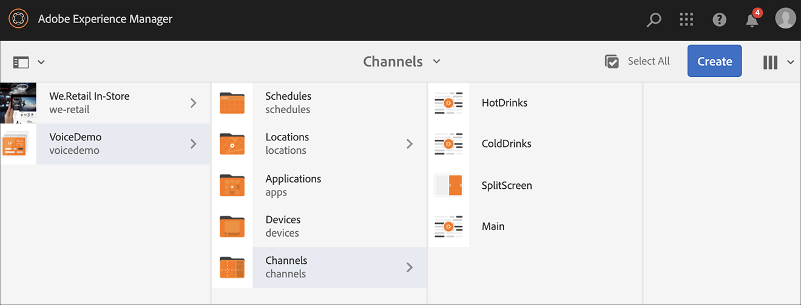
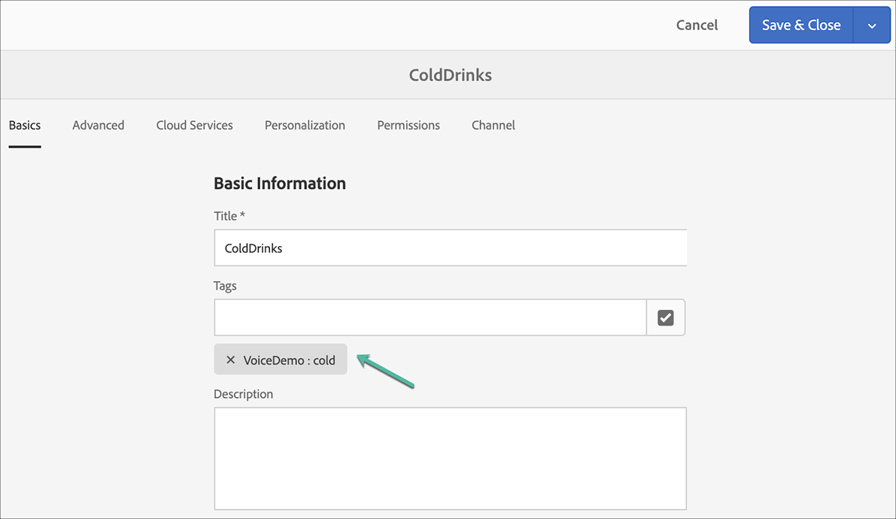

# Spraakherkenning in AEM Screens {#voice-recognition}

>[!IMPORTANT]
>
>**Belangrijke privacygegevens**
>
>Wanneer het gebruiken van de eigenschap van de stemerkenning volgt alle toepasselijke wettelijke en ethische richtlijnen voor uw regio (met inbegrip van maar niet beperkt tot het verstrekken van een zichtbare kennisgeving aan eindgebruikers dat de speler de Erkenning van de Stem gebruikt). Adobe Inc., ontvangt, slaat of verwerkt geen van de stemgerelateerde informatie op. De AEM Screens-spelers gebruiken de standaard webspraak-API die in de bladerengine is ingebouwd. Achter de schermen verzendt deze API een golfvorm van uw toespraak naar de servers van Google voor omzetting van spraak in tekst en deze tekst wordt aangepast door de speler aan gevormde sleutelwoorden.
>
>Raadpleeg [Google Privacy White-paper on web speech API](https://www.google.com/chrome/privacy/whitepaper.html#speech) voor meer informatie.

De eigenschap van de stemerkenning staat inhoudsverandering in een kanaal van AEM Screens toe dat door steminteractie wordt gedreven.

Een inhoudauteur kan een vertoning vormen om toegelaten stem te zijn. Het doel van deze eigenschap is klanten toe te staan om toespraak als methode te gebruiken om met hun vertoningen in wisselwerking te staan. Tot andere gebruiksgevallen behoren het vinden van productaanbevelingen in winkels, het bestellen van menu-items in restaurants en diners. Deze functie vergroot de toegankelijkheid voor gebruikers en kan de gebruikerservaring aanzienlijk verbeteren.

>[!NOTE]
>De spelerhardware moet audio-invoer, zoals een microfoon, ondersteunen.

## Het uitvoeren van Stem Erkenning {#implementing}

>[!IMPORTANT]
> De functie voor spraakherkenning is alleen beschikbaar voor Chrome OS- en Windows-spelers.

Als u spraakherkenning wilt implementeren in uw AEM Screens-project, moet u de spraakherkenning inschakelen voor de weergave en elk kanaal koppelen aan een unieke tag om een kanaalovergang te activeren.

In de volgende sectie wordt beschreven hoe u de functie voor spraakherkenning in een AEM Screens-project kunt inschakelen en gebruiken.

## Inhoud weergeven in Volledig scherm of Kanaalschakelaar gesplitst scherm {#sequence-channel}

Alvorens u de eigenschap van de stemerkenning gebruikt, zorg ervoor u een project en een kanaal met inhoud hebt opstelling voor uw project.

1. In het volgende voorbeeld ziet u een demoproject met de naam **VoiceDemo** en drie volgordekanalen **Main**, **ColdDrinks** en **HotDrinks**, zoals in de onderstaande afbeelding wordt getoond.

   

   >[!NOTE]
   >
   >Meer informatie over het maken van een kanaal of het toevoegen van inhoud aan een kanaal vindt u in [Kanalen maken en beheren](/help/user-guide/managing-channels.md)

   Of

   U kunt drie opeenvolgende kanalen **Main**, **ColdDrinks** en **HotDrinks**, en één extra 1x2 gesplitste kanaal **SplitScreen** zoals aangetoond in de hieronder figuur tot stand brengen.

   

1. Navigeer naar elk kanaal en voeg inhoud toe. Navigeer bijvoorbeeld naar **VoiceDemo** —> **Kanalen** —> **Main** en selecteer het kanaal. Klik op **Bewerken** op de actiebalk om de editor te openen en naar wens inhoud (afbeeldingen/video&#39;s) toe te voegen. Voeg op dezelfde manier inhoud toe aan zowel **ColdDrinks** als **HotDrinks** kanaal.

   De kanalen bevatten nu elementen (afbeeldingen), zoals in de onderstaande afbeeldingen wordt getoond.

   **Hoofd**:

   

   **ColdDrinks**:

   

   **HotDrinks**:

   

   Als u het gesplitste kanaal van de Schermen aan uw project hebt toegevoegd, navigeer aan **SplitScreen** en sleep en laat vallen twee ingebedde opeenvolgingen en voeg wegen aan zowel **ColdDrinks** als **HotDrinks** kanaal zoals aangetoond in het hieronder cijfer toe.
   

### Labels instellen voor kanalen {#setting-tags}

Zodra u inhoud aan uw kanalen hebt toegevoegd, moet u aan elk van de kanalen navigeren en aangewezen markeringen toevoegen die de stemerkenning zouden teweegbrengen.

Voer de onderstaande stappen uit om codes aan uw kanaal toe te voegen:

1. Navigeer naar elk kanaal en voeg inhoud toe. Navigeer bijvoorbeeld naar **VoiceDemo** —> **Kanalen** —> **Main** en selecteer het kanaal.

1. Klik **Eigenschappen** van de actiebar.

   

1. Navigeer naar **Basics** tabblad en selecteer een bestaand label in het veld **Codes** of maak een nieuw label.

   U kunt een nieuwe tag maken door een nieuwe naam voor de tag in te voeren en op `return` te drukken, zoals in de onderstaande afbeelding wordt getoond:

   

   Of

   U kunt ook van tevoren tags maken voor uw AEM en deze selecteren. Nadat u de stappen hebt uitgevoerd die worden beschreven in [Codes maken](#creating-tags), kunt u de code selecteren op de locatie en toevoegen aan het kanaal, zoals in de onderstaande afbeelding wordt getoond:

   

1. U kunt ook tag **hot** toevoegen aan het kanaal **HotDrinks**.

1. Als u een gesplitst kanaal van de Schermen gebruikt, voeg zowel de markeringen (**hot** als **cold**) aan **SplitScreen** kanaaleigenschappen, zoals aangetoond in het hieronder cijfer toe.

   

1. Klik **Opslaan en sluiten** als u klaar bent.

### Codes {#creating-tags} maken

Ga als volgt te werk om labels te maken:

1. Navigeer naar de AEM.

1. Klik op gereedschapspictogram —> **Tags toevoegen**.
   

1. Klik **Create** —> **Create Namespace**.
   

1. Voer de naam van uw project in, bijvoorbeeld **VoiceDemo** en klik op **Create**.

1. Selecteer het **VoiceDemo**-project en klik op **Tag maken** op de actiebalk.
   

1. Voer de naam van de tag in en klik op **Verzenden**.
   

U kunt deze labels nu gebruiken in uw AEM Screens-project.

### Het toewijzen van Kanaal aan een Vertoning en het toelaten van de Erkenning van de Stem {#channel-assignment}

1. Maak een weergave in de map **Locations**, zoals in de onderstaande afbeelding wordt getoond.

   

   >[!NOTE]
   >Leer hoe te om een kanaal aan een vertoning toe te wijzen, verwijs naar [Creërend en het Leiden Vertoningen](/help/user-guide/managing-displays.md).

1. Wijs de kanalen **Main**, **ColdDrinks**, en **HotDrinks** aan **LobbyDisplay** toe. Bovendien, als u **SplitScreen** kanaal voor uw project gebruikt, zorg ervoor u dat aan de vertoning toewijst.

   >[!NOTE]
   >Als u een gesplitst-schermkanaal hebt gemaakt, wijst u het kanaal **SplitScreen** aan uw scherm toe.

1. Stel de volgende eigenschappen in voor elk kanaal terwijl u het kanaal toewijst.

   | **Kanaalnaam** | **Prioriteit** | **Ondersteunde gebeurtenissen** |
   |---|---|---|
   | Hoofd | 2 | Eerste belasting, inactief scherm, timer |
   | HotDrinks | 1 | Gebruikersinteractie |
   | ColdDrinks | 1 | Gebruikersinteractie |
   | SplitScreen | 1 | Gebruikersinteractie |

   >[!NOTE]
   >
   >Leer hoe te om een kanaal aan een vertoning toe te wijzen, verwijs naar [Creërend en het Leiden Vertoningen](/help/user-guide/managing-displays.md).

1. Nadat u kanalen aan een weergave hebt toegewezen, navigeert u naar **LobbyDisplay** en selecteert u de weergave. Selecteer **Eigenschappen** in de actiebalk.

1. Navigeer naar het tabblad **Display** en schakel **Voice ingeschakeld** in onder **Content**.

   

   >[!IMPORTANT]
   >Het is verplicht om de functie voor spraakherkenning vanuit de weergave in te schakelen.

### De inhoud weergeven in de Chrome-speler {#viewing-content}

Wanneer de voorgaande stappen zijn voltooid, kunt u het chroomapparaat registreren om de uitvoer weer te geven.

>[!NOTE]
>Raadpleeg [Apparaatregistratie](device-registration.md) voor informatie over het registreren van een apparaat voor een AEM Screens-speler.

**Gewenste uitvoer voor sequentiekanaal**

Het **Main** kanaal speelt zijn inhoud af, maar wanneer u woorden met sleutelwoord **heet** zoals *ik zou een hete drankje* willen hebben, begint het kanaal het spelen van de inhoud van **HotDrinks** kanaal.

Op dezelfde manier als u woord met een sleutelwoord **kou** zoals *ik zou willen iets kouds* hebben, begint het kanaal de inhoud van **ColdDrinks** kanaal te spelen.

**Gewenste uitvoer voor gesplitste schermkanalen**

Het **Main** kanaal speelt zijn inhoud, maar wanneer u woorden met sleutelwoord **heet** en **koud** samen zoals *ik zou het menu voor hete en koude dranken* willen zien, begint het kanaal de inhoud van **SplitScreen** te spelen. Als u *terug naar hoofdmenu* zegt, schakelt het terug naar het belangrijkste kanaal.

